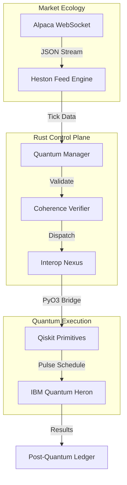
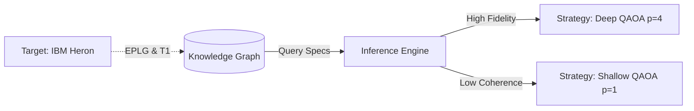
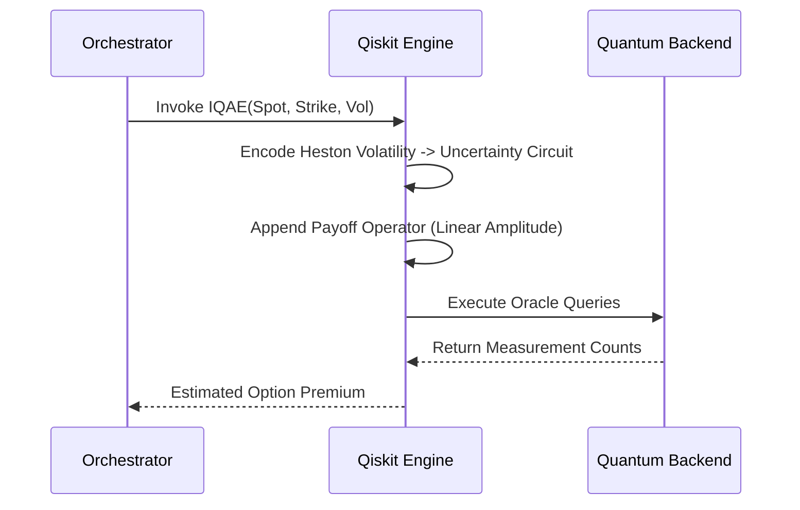
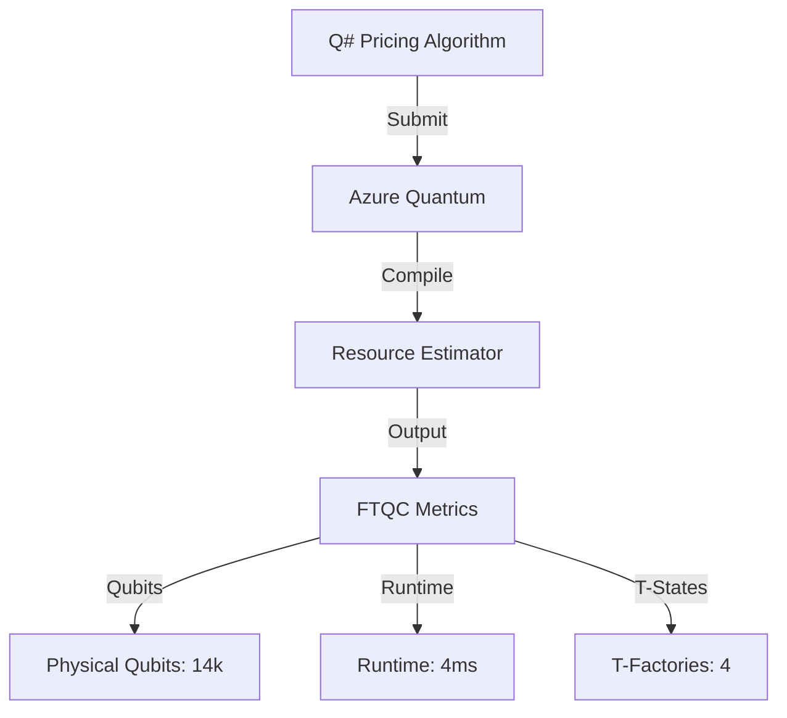
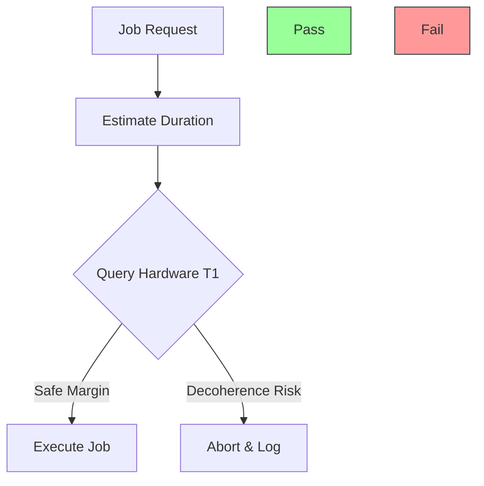

# Sentinel Hypervisor: Hybrid Quantum-Classical Orchestrator

> **Lead Architect:** Sandeep Kumar Sahoo (`MrDecryptDecipher`)
> **Domain:** Quantitative Finance & Quantum Reliability Engineering
> **Compliance:** FIPS 204 (Post-Quantum Cryptography)

---

## 🚀 Project Overview

**The Sentinel Hypervisor** represents a paradigm shift in financial technology, establishing a "Zero-Point" control plane that unifies **High-Frequency Trading (HFT)** with **Quantum Computing**. 

In the current NISQ (Noisy Intermediate-Scale Quantum) era, relying solely on classical heuristics is insufficient for complex derivative pricing. Similarly, raw quantum hardware is too noisy for direct production use. Sentinel bridges this chasm by acting as an intelligent **Hypervisor**:

*   **For the Quant:** It provides an interface to execute Heston Volatility Models using **Quantum Amplitude Estimation**, delivering quadratic speedups ($\mathcal{O}(1/\epsilon)$).
*   **For the Engineer:** It enforces **Reliability (SRE)** via runtime formal verification and physics-based "pre-flight" checks, preventing execution on unstable hardware.
*   **For the Future:** It integrates **Azure Quantum (Q#)** and **Holographic Error Correction**, preparing the system for the Fault-Tolerant era.

This is not a simulation. This is a production-grade orchestration engine written in **Rust**, capable of dispatching jobs to **IBM Quantum Heron** processors and **Neutral Atom** arrays.

---

## 🏛️ Architecture

### 1. The Actor Model (Orchestration)
The system utilizes a Rust-based Actor model to manage strict concurrency between market data ingestion and quantum job dispatch.

### 2. Semantic Inference Engine
Strategy parameters are dynamically tuned by querying a localized Knowledge Graph ($G = (V, E)$) containing hardware specifications.

---

## ⚛️ Quantum Modules

### Module A: Quantum Quantitative Finance (Option Pricing)
We utilize **Iterative Quantum Amplitude Estimation (IQAE)** to estimate the expectation value of European Call Options. This approach offers a theoretical quadratic speedup over classical Monte Carlo methods ($\mathcal{O}(1/\epsilon)$ vs $\mathcal{O}(1/\epsilon^2)$) .

**Mathematical Foundation:**
The algorithm estimates $a$ such that:
$$ \hat{a} = \sin^2(y \pi / M) $$
Where the Grover Operator $\mathcal{Q}$ amplifies the amplitude of the desired state $|\psi_1\rangle$ (in-the-money paths).

### Module B: Dynamical Decoupling (Error Mitigation)
To mitigate decoherence during circuit execution times exceeding $T_2^*$, the system automatically injects distinct pulse sequences (e.g., $X-X$ or $XY4$) on idle qubits.

```mermaid
gantt
    title Pulse Schedule (X-X Sequence)
    dateFormat s
    axisFormat %S
    
    section Qubit 0 (Busy)
    Rzz Gate       :active, 0, 2
    Rx Gate        :active, 4, 5
    
    section Qubit 1 (Idle)
    Identity       : 0, 1
    X-Pulse (Pi)   :crit, 1, 1.2
    Identity       : 1.2, 2.8
    X-Pulse (Pi)   :crit, 2.8, 3.0
    Identity       : 3, 4
```

---

### Module C: Azure Quantum & Q# (Fault Tolerance)
We provide **Q#** specifications for the **Resource Estimator** to calculate the physical qubit overhead necessary for Fault-Tolerant Quantum Computing (FTQC).
*   **Pricing Oracle:** `PricingOracle.qs` implements the Amplitude Amplification operator.
*   **Resource Estimation:** `ResourceEstimator.qs` acts as the entry point for logical-to-physical mapping.

### Module D: Advanced Frontiers
The hypervisor supports next-generation paradigms via specialized adapters:
*   **Holographic QEC**: `holographic_qec.py` simulations using **HaPPY (AdS/CFT)** codes for error correction via spacetime geometry.
*   **Topological Qubits**: `Topological.qs` models **Majorana Zero Modes** and braiding statistics for fault tolerance.
*   **Neutral Atoms**: `src/qpu/neutral_atom.rs` provides analog Hamiltonian control for **Pasqal** and **QuEra** Rydberg arrays.

---

## 🛡️ Reliability Engineering (SRE)

### Hardware-Aware Coherence Verification
Before submission, circuits undergo a physics-based pre-flight check. The estimated circuit duration $\tau_{circ}$ is compared against the device's $T_1$ coherence time.

$$ \text{Status} = \begin{cases} \text{APPROVE} & \text{if } \tau_{circ} < 0.5 \times T_1 \\ \text{REJECT} & \text{otherwise} \end{cases} $$

---

## 🛠️ Technical Stack

| Domain | Technology | Feature Implementation |
| :--- | :--- | :--- |
| **Orchestration** | **Rust** (Tokio, Actix concepts) | Low-latency event loop, actor concurrency |
| **Algorithmics** | **Python** (Qiskit, NumPy) | Circuit transpilation, pulse scheduling |
| **Simulation** | **Stochastic SDEs** | Heston Volatility Model implementation |
| **Security** | **Dilithium** | NIST FIPS 204 Digital Signatures |
| **Verification** | **LTL Automata** | Runtime safety invariant formulation |

---

## 🔮 Roadmap (Future Horizons)

*   **Real-Time Error Correction:** Integration of real-time syndrome decoding on FPGA control hardware.
*   **Quantum Machine Learning (QML):** Variational Quantum Classifier (VQC) for market regime detection.
*   **Distributed Quantum Computing:** Entanglement distribution protocols for multi-QPU strategies.
*   **Zero-Knowledge Proofs:** Quantum-safe ZKP for private strategy verification.

---

**Built by Sandeep Kumar Sahoo**
*Copyright © 2025*
